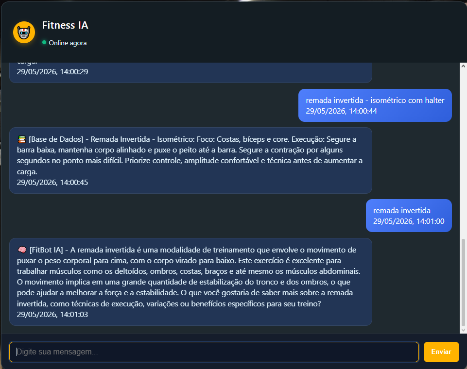

# 🏋️‍♂️ Chatbot Fitness: Assistente de Treino Inteligente

## Grupo

- Igor Gabriel Rodrigues
- Pedro José Guimarães Coelho
- Rodrigo Debortoli de Souza
- Davi dos Santos Morais
- Luiz Felipe Lamas Mishima

## Tecnologias Utilizadas

O projeto foi construído utilizando uma stack moderna que separa a experiência do usuário (Frontend) da inteligência de processamento (Backend):

- **Linguagem:** Python 3.12
- **Backend:** Flask (Micro-framework web)
- **NLP (Processamento de Linguagem Natural):** NLTK (Natural Language Toolkit)
- **Gerenciamento de Ambiente:** Python-dotenv (Variáveis de ambiente)
- **Frontend:** HTML5, CSS3 (Variáveis nativas e Flexbox) e JavaScript (Async/Await Fetch API)

## Inteligência e NLP (NLTK)

Diferente de um chatbot baseado em regras rígidas, o FitBot utiliza processamento de texto para entender a intenção do usuário. O fluxo de processamento segue estas etapas:

1. **Tokenização:** A entrada do usuário é dividida em unidades (tokens) individuais.
2. **Normalização:** Conversão de todo o texto para letras minúsculas.
3. **Filtragem (Stopwords):** Remoção de palavras irrelevantes (como "de", "a", "o", "com") que não carregam significado semântico para o treino.
4. **Mapeamento de Intenções:** O bot compara os tokens resultantes com um dicionário de conhecimentos especializado em academia.

> **Diferencial Pedagógico:** O bot foi programado para nunca encerrar a interação com respostas secas. Todas as 1500+ intenções mapeadas terminam com uma pergunta de engajamento, mantendo o fluxo da conversa ativo (Context-Aware Design).

## Estrutura do Projeto

```
/
├── .env                   # Arquivo local com variáveis de ambiente (confidencial)
├── app.py                 # Servidor Flask, inicialização das configurações e rotas da API
├── chatbot_logic.py       # Lógica de NLP e dicionário de conhecimentos (NLTK)
├── base_conhecimento.json # Base de dados interna
├── templates/
│   └── index.html         # Estrutura da interface web
├── static/
│   ├── css/
│   │   └── styles.css     # Estilização e layout responsivo
│   ├── js/
│   │   └── app.js         # Integração Frontend-Backend (Fetch API)
│   └── assets/            # Identidade visual e imagens
└── README.md              # Documentação do projeto

```

## Como Executar

1. Pré-requisitos
   Certifique-se de ter o Python instalado. Recomenda-se o uso de um ambiente virtual (`venv`).

```bash
python -m venv
```

2. Instalação das Dependências
   No terminal, execute:

```Bash
pip install flask nltk

pip install python-dotenv

```

3. Configuração do NLTK

Na primeira execução, o bot baixará automaticamente os recursos necessários (`punkt`, `punkt_tab` e `stopwords`). Caso prefira baixar manualmente:

```Python
import nltk
nltk.download('punkt_tab')
nltk.download('stopwords')
```

4. Iniciando o Servidor

```Bash
python app.py
```

Após iniciar, acesse no navegador: `http://127.0.0.1:5000`

## Exemplos de Interação



## Decisões de Desenvolvimento e Mudanças Importantes

- **Segurança e Configuração (.env)** Isolamento de propriedades estruturais e variáveis de inicialização do Flask através do `python-dotenv`, garantindo que credenciais e modos de execução não fiquem expostos diretamente no código fonte enviado ao repositório.

- **Interface Responsiva:** O layout foi projetado para funcionar tanto em desktops quanto em dispositivos móveis (Mobile First).

- **Feedback Visual:** Implementação de um estado de "Digitando..." para simular uma interação humana e melhorar a UX (User Experience).

- **Escalabilidade:** A lógica do bot foi separada em uma classe (AcademiaBot), facilitando a integração com bancos de dados ou APIs de IA generativa.
